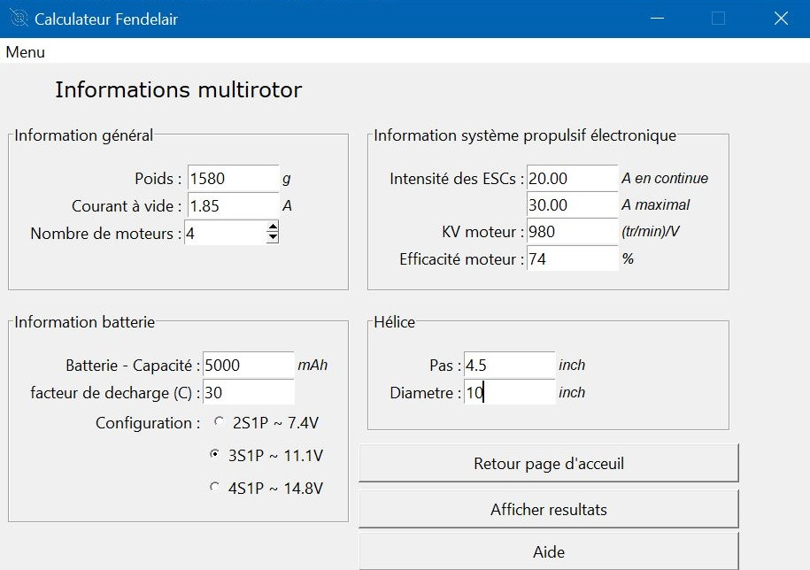
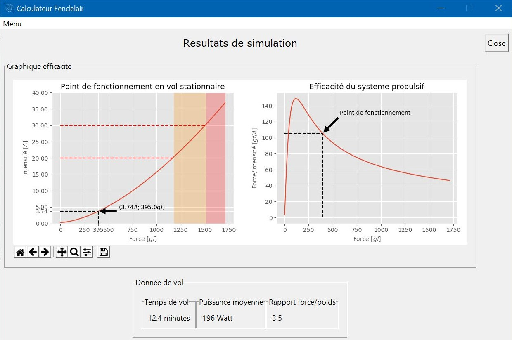

# Drone flight time calculator

The GUI ease the calculation of the flight time of a drone by giving its caracteristics.
The math are based on an empirical formula developed on the analysis of several data on propellers.

This project is higly similar to [eCalc calculator](https://www.ecalc.ch/xcoptercalc.php "eCalc")

## GUI developed with TKinter

